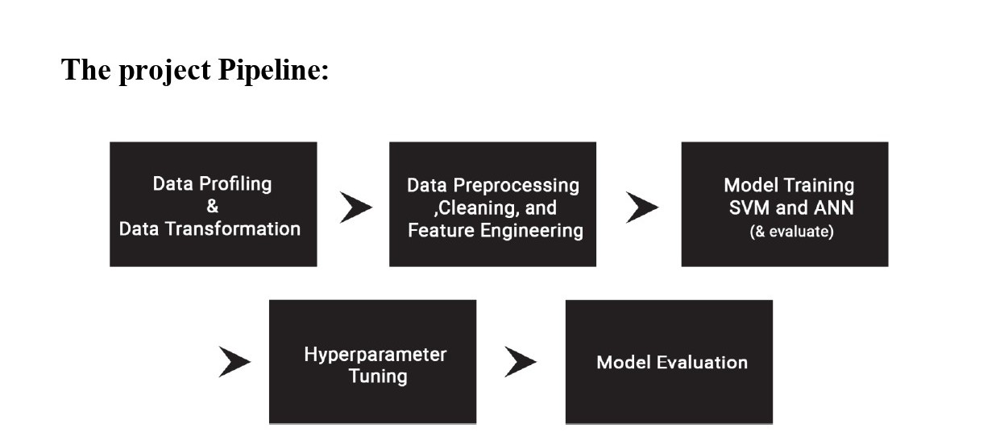
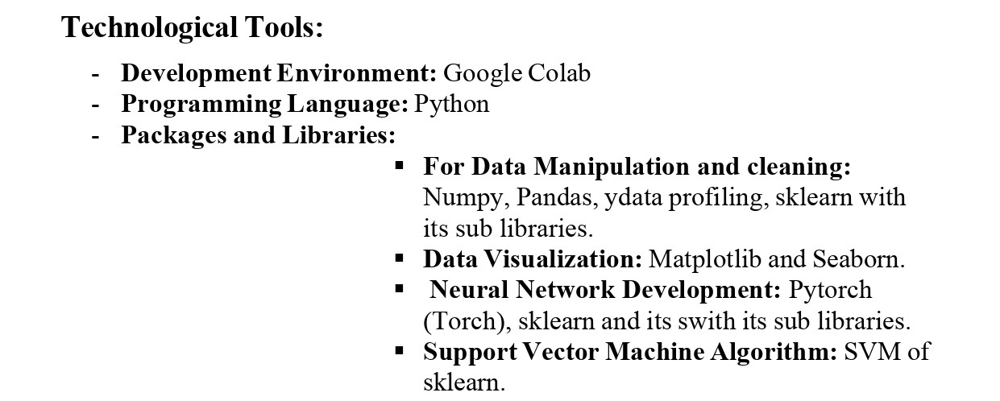
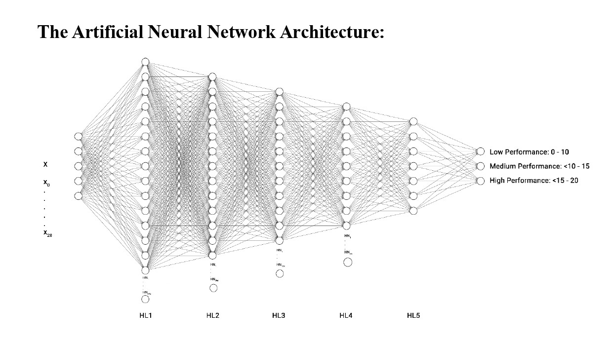

# A Comparative Study on Predicting High-School Student Performance Using Neural Networks and SVM

## Overview

This project presents a comparative analysis of Neural Networks (NN) and Support Vector Machines (SVM) for predicting high-school student performance in Mathematics. Using the UCI Student Performance Dataset, we evaluate model effectiveness through cross-validation, error rates, confusion matrices, and ROC curves.

## Dataset

Source: [UCI Student Performance Dataset](https://archive.ics.uci.edu/dataset/320/student+performance)

Attributes: Socioeconomic factors, academic history, and behavioural attributes.

Target Variable: Final grade in Mathematics (G3);  follow our categorized guideline: 
* Bin 1: grades from 0 to 10
* Bin 2: grades from 10 to 15
* Bin 3: grades from 15 to 20

## Methodology (Project Pipeline)

## Technical Tools

## ANN Architecture 

## For accessing the full report (including ROC, AUC, Confusion matrix and more)
[Full Summarized Project Report](Final_Report_.pdf)
